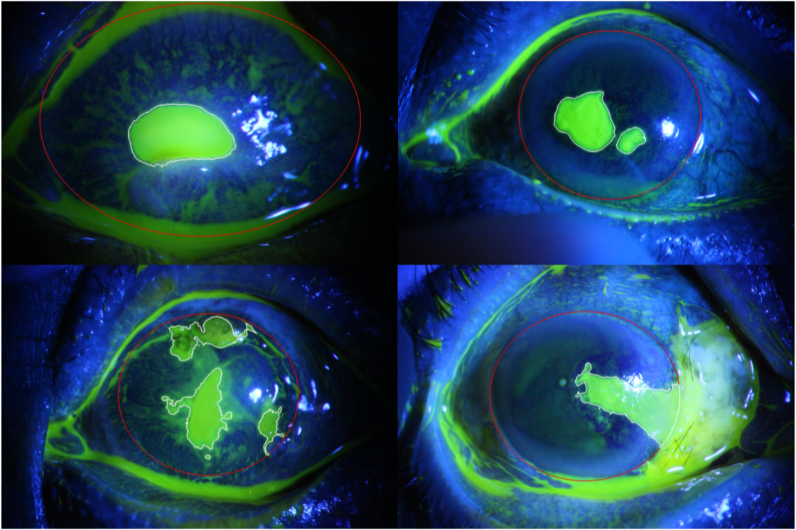

# The SUSTech SYSU dataset for automatically segmenting and classifying corneal ulcers (SUSTech-SYSU)



The SUSTech SYSU dataset for automatically segmenting and classifying corneal ulcers (SUSTech-SYSU) is an ocular fluroscein staining image dataset of corneal ulcers:

> **The SUSTech SYSU dataset for automatically segmenting and classifying corneal ulcers**<br>
> Lijie Deng, Junyan Lyu, Haixiang Huang, et al.<br>
> https://doi.org/10.1038/s41597-020-0360-7

This repository contains the official baseline implementation of our papers:

> **Adjacent Scale Fusion and Corneal Position Embedding for Corneal Ulcer Segmentation**<br>
> Zhonghua Wang, Junyan Lyu, Wenhao Luo, Xiaoying Tang.<br>
> To appear at MICCAI Workshop OMIA8 2021.

Corneal ulcer is a common ophthalmic symptom. Segmentation algorithms are needed to identify and quantify corneal ulcers from ocular staining images. Developments of such algorithms have been obstructed by a lack of high quality datasets (the ocular staining images and the corresponding gold-standard ulcer segmentation labels), especially for supervised learning based segmentation algorithms. In such context, we prepare a dataset containing 712 ocular staining images and the associated segmentation labels of flaky corneal ulcers. In addition to segmentation labels for flaky corneal ulcers, we also provide each image with three-fold class labels: firstly, each image has a label in terms of its general ulcer pattern; secondly, each image has a label in terms of its specific ulcer pattern; thirdly, each image has a label indicating its ulcer severity degree. This dataset not only provides an excellent opportunity for investigating the accuracy and reliability of different segmentation and classification algorithms for corneal ulcers, but also advances the development of new supervised learning based algorithms especially those in the deep learning framework.

## Quick start
### Environment
This code is developed using on **Python 3.8.5** and **Pytorch 1.7.1** on CentOS7 with NVIDIA GPUs. Training and testing are performed using 1 RTX 3090 GPU with CUDA 11.0. Other platforms or GPUs are not fully tested.

### Install
1. Install Pytorch.
2. Install dependencies:
```shell
pip install -r requirements.txt
```
3. Install `surface-distance` package via pip:
```shell
git clone https://github.com/deepmind/surface-distance.git
pip install surface-distance/
```

### Train
Please specify the configuration file in ```experiments```.
```shell
cd src
sh experiments/asf_cpe.sh
```

## Citation
Deng, L., Lyu, J., Huang, H. et al. The SUSTech-SYSU dataset for automatically segmenting and classifying corneal ulcers. Sci Data 7, 23 (2020). https://doi.org/10.1038/s41597-020-0360-7
